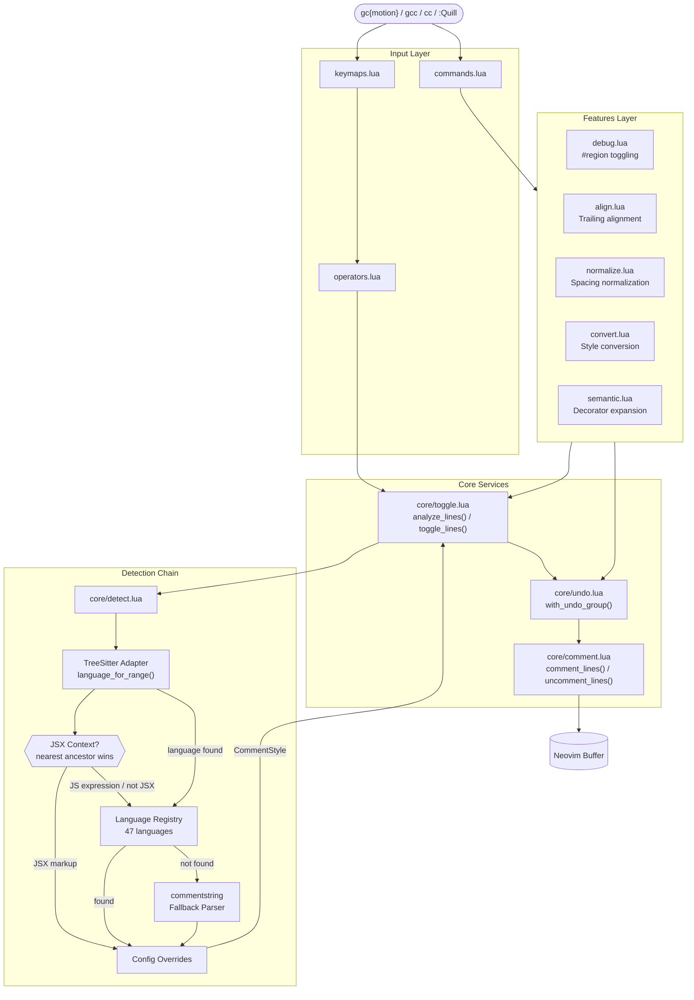

# quill.nvim

Intelligent comment toggling for Neovim with TreeSitter context detection, 47 built-in languages, and advanced comment tooling.

## Table of Contents

- [Overview](#overview)
- [Why quill.nvim?](#why-quillnvim)
  - [quill vs Alternatives](#quill-vs-alternatives)
- [Features](#features)
- [Dependencies](#dependencies)
- [Installation](#installation)
- [Configuration](#configuration)
  - [Custom Languages](#custom-languages)
  - [Disabling Keymap Groups](#disabling-keymap-groups)
- [Usage](#usage)
  - [Basic Setup](#basic-setup)
  - [Operators](#operators)
  - [Text Objects](#text-objects)
  - [JSX-Aware Commenting](#jsx-aware-commenting)
  - [Debug Regions](#debug-regions)
  - [Trailing Comment Alignment](#trailing-comment-alignment)
  - [Comment Normalization](#comment-normalization)
  - [Style Conversion](#style-conversion)
  - [Semantic Selection](#semantic-selection)
  - [Commands](#commands)
  - [API](#api)
- [Supported Languages](#supported-languages)
- [Architecture](#architecture)
- [License](#license)

## Overview

quill.nvim is a comment plugin for Neovim that goes beyond toggling. It detects comment context with TreeSitter -- including JSX markup vs. JavaScript expressions, embedded languages, and nesting-aware block comments across 47 languages -- and builds on that foundation to offer trailing comment alignment, spacing normalization, style conversion, debug region management (buffer and project-wide), semantic selection expansion for decorators and docstrings, and four comment text objects composable with any Vim operator. Zero configuration required.

## Why quill.nvim?

Most comment plugins solve the same problem: map `gcc` to toggle a line. They delegate everything else -- which comment marker to use, how to handle JSX, what to do with block comments -- to Neovim's built-in `commentstring` setting. That works until it doesn't. In a `.tsx` file, `commentstring` gives you one answer for the whole buffer, but inside JSX markup you need `{/* */}`, inside a JavaScript expression you need `//`, and inside an HTML attribute you might need something else entirely. The "one setting per buffer" model is a simplification that shows its seams precisely in the files you work in most.

quill is built around a different premise: comment toggling is a context detection problem first, and a text manipulation problem second. Its TreeSitter layer queries the syntax tree at the exact cursor position, walks ancestor nodes to determine the nearest relevant context, and selects the appropriate comment style without any configuration from you. JSX nesting is handled natively -- no companion plugins, no manual overrides. The same detection engine drives every other feature: alignment, normalization, and style conversion all know which language they're operating on, line by line, because they share the same detection layer.

Beyond toggle operations, quill treats comment hygiene as a workflow concern. Debug regions -- code wrapped in `#region debug` / `#endregion` markers -- can be commented out with a single binding and restored just as easily. The same operation scales to the entire project: one command scans every source file (via ripgrep when available), finds every debug region, and toggles them all uniformly. Trailing comment alignment and normalization address a different kind of maintenance: the accumulated inconsistency of `//foo` next to `// bar` next to `/* baz */` that builds up across a file over time.

quill is designed to be the last comment plugin you configure. It works out of the box for 47 languages, falls back gracefully to `commentstring` for everything else, and exposes a full programmatic API for the cases where you want to drive commenting behavior from your own scripts or plugin integrations.

### quill vs Alternatives

| Feature | quill.nvim | Comment.nvim | mini.comment | vim-commentary |
|---------|:----------:|:------------:|:------------:|:--------------:|
| Line comment toggle | Yes | Yes | Yes | Yes |
| Block comment toggle | Yes | Yes | No | No |
| Vim operator (`gc{motion}`) | Yes | Yes | Yes | Yes |
| Dot-repeat | Yes | Yes | Yes | Yes |
| Count support (`3gcc`) | Yes | Yes | Yes | Yes |
| TreeSitter language detection | Native | External plugin | Yes | No |
| JSX/TSX context awareness | Native | External plugin | No | No |
| Embedded language detection | Native | External plugin | Yes | No |
| Comment text objects | 4 (`ic` `ac` `iC` `aC`) | Motions only | 1 (`gc`) | None |
| Built-in language registry | 47 languages | `commentstring` | `commentstring` | `commentstring` |
| Nesting-aware block comments | Yes | No | No | No |
| Debug region management | Buffer + project | No | No | No |
| Trailing comment alignment | Yes | No | No | No |
| Comment normalization | Yes | No | No | No |
| Style conversion (line / block) | Yes | No | No | No |
| Semantic selection (decorators) | Yes | No | No | No |
| Quickfix integration | Yes | No | No | No |
| Programmatic API | Full | Partial | No | No |

## Features

- **TreeSitter context detection** -- Resolves the language at the exact cursor position, not just the buffer filetype
- **Native JSX/TSX support** -- "Nearest ancestor wins" tree traversal distinguishes JSX markup from JavaScript expressions
- **47 built-in languages** -- With graceful `commentstring` fallback for everything else
- **Full Vim operator** -- `gc{motion}` composes with any motion or text object, dot-repeatable
- **4 comment text objects** -- `ic`, `ac`, `iC`, `aC` for inner/around at block/line granularity
- **Debug region management** -- Toggle `#region debug` blocks per-buffer or across the entire project
- **Trailing comment alignment** -- Align inline comments to a consistent column with string-awareness
- **Comment normalization** -- Fix inconsistent spacing (`//foo` -> `// foo`) across a buffer in one command
- **Style conversion** -- Convert between line (`//`) and block (`/* */`) comment styles
- **Semantic selection** -- Automatically include decorators and doc comments when commenting functions
- **Nesting-aware block comments** -- Correct handling for Rust, Haskell, OCaml, Swift, Nim, Scheme, Racket, Lisp
- **Programmatic API** -- Every feature accessible via `require("quill")` for scripting and integration

## Dependencies

- **Neovim >= 0.10**
- **TreeSitter** (optional) -- Enhances detection for embedded languages and JSX context

## Installation

### lazy.nvim

```lua
{
  "josstei/quill.nvim",
  event = "VeryLazy",
  opts = {},
}
```

### packer.nvim

```lua
use({
  "josstei/quill.nvim",
  config = function()
    require("quill").setup()
  end,
})
```

### mini.deps

```lua
MiniDeps.add({ source = "josstei/quill.nvim" })
require("quill").setup()
```

## Configuration

All options are optional. Shown here with defaults:

```lua
require("quill").setup({
  align = {
    column = 80,                -- Target column for trailing comment alignment
    min_gap = 2,                -- Minimum spaces between code and comment
  },

  debug = {
    start_marker = "#region debug",
    end_marker = "#endregion",
  },

  keymaps = {
    operators = true,           -- Register gc / gcc / visual gc
    textobjects = true,         -- Register ic, ac, iC, aC
    leader = true,              -- Register <leader>cc, <leader>cd, <leader>cD, <leader>cn, <leader>ca
  },

  operators = {
    toggle = "gc",              -- Operator prefix (line variant auto-derived as gcc)
    toggle_line = nil,          -- Explicit override for line toggle key
  },

  textobjects = {
    inner_block = "ic",
    around_block = "ac",
    inner_line = "iC",
    around_line = "aC",
  },

  mappings = {
    toggle = "<leader>cc",
    debug_buffer = "<leader>cd",
    debug_project = "<leader>cD",
    normalize = "<leader>cn",
    align = "<leader>ca",
  },

  warn_on_override = true,      -- Warn when overriding existing keymaps

  languages = {},               -- Custom/override language definitions

  jsx = {
    auto_detect = true,         -- TreeSitter-based JSX context detection
  },

  semantic = {
    include_decorators = true,  -- Include decorators in semantic selection
    include_doc_comments = true, -- Include doc comments in semantic selection
  },
})
```

### Custom Languages

Extend or override the built-in language registry. All fields are optional -- omitted fields fall through to built-in defaults:

```lua
require("quill").setup({
  languages = {
    myfiletype = {
      line = "//",
      block = { "/*", "*/" },
      supports_nesting = false,
      jsx = false,
    },
  },
})
```

### Disabling Keymap Groups

Disable any combination of keymap groups and define your own bindings via the [API](#api):

```lua
require("quill").setup({
  keymaps = {
    operators = false,
    textobjects = false,
    leader = false,
  },
})
```

## Usage

### Basic Setup

```lua
require("quill").setup()
```

All keymaps, text objects, and commands activate automatically.

### Operators

`gc` is a full Vim operator -- compose it with any motion or text object:

```
gcc             Toggle current line
3gcc            Toggle 3 lines
gcap            Toggle a paragraph
gcac            Uncomment a comment block (from inside it)
gc5j            Toggle 5 lines down
gcG             Toggle to end of file
Vjjgc           Visual select 3 lines, toggle
```

```lua
-- Before: cursor on this line, press gcc
local x = 42

-- After:
-- local x = 42
```

In visual-line and block-visual mode, quill uses block comments when the language supports them. The operator supports dot-repeat (`.`).

### Text Objects

Select and operate on comments using standard Vim motions:

| Object | Scope |
|--------|-------|
| `ic` | Inner comment block (content only) |
| `ac` | Around comment block (includes markers) |
| `iC` | Inner comment line (content only) |
| `aC` | Around comment line (entire line) |

Combine with any operator: `dic` (delete), `cac` (change), `yiC` (yank), `vaC` (select).

### JSX-Aware Commenting

In React files (`.jsx`, `.tsx`), quill detects context via TreeSitter and applies the correct comment style automatically:

```jsx
function App() {
  // JavaScript context uses // comments
  return (
    <div>
      {/* JSX context uses {/* */} comments */}
      <span>{value /* Expression context uses /* */ */}</span>
    </div>
  );
}
```

The "nearest ancestor wins" algorithm walks the syntax tree to distinguish JSX markup from JavaScript expressions -- no companion plugins required.

### Debug Regions

Mark code sections with `#region debug` / `#endregion` and toggle them in bulk:

```javascript
// #region debug
console.log("Debug info:", data);
debugger;
// #endregion
```

| Mapping | Description |
|---------|-------------|
| `<leader>cd` | Toggle debug regions in current buffer |
| `<leader>cD` | Toggle debug regions across the entire project |
| `:Quill debug --list` | List debug regions in quickfix window |

Project-wide toggle uses ripgrep when available, respects file size limits, and wraps all changes in a single undo group per buffer.

### Trailing Comment Alignment

Align inline comments to a consistent column:

```javascript
// Before                              // After
const x = 1; // short                  const x = 1;               // short
const longVariableName = 2; // value   const longVariableName = 2; // value
```

Use `<leader>ca` on a single line or `:'<,'>Quill align` over a visual selection. The scanner is string-aware -- it won't misidentify `//` inside string literals.

### Comment Normalization

Fix inconsistent comment spacing across a buffer or selection:

```javascript
// Before                    // After
//foo                        // foo
//  bar                      // bar
/*baz*/                      /* baz */
/*   qux   */                /* qux */
```

Use `<leader>cn` for the whole buffer or `:'<,'>Quill normalize` for a selection.

### Style Conversion

Convert between line and block comment styles:

```javascript
// Before :Quill convert block       // After
// first line                         /* first line
// second line                           second line */
```

Use `:'<,'>Quill convert line` or `:'<,'>Quill convert block` on a visual selection.

### Semantic Selection

When commenting functions, quill can automatically expand the selection to include attached decorators and doc comments:

```python
# With include_decorators and include_doc_comments enabled:

@app.route("/api")           # <-- included
def handle_request():
    """Handle the request."""  # <-- included
    return response
```

Supports Python decorators/docstrings, JSDoc in JavaScript/TypeScript, and Java annotations.

### Commands

| Command | Description |
|---------|-------------|
| `:Quill debug` | Toggle debug regions in buffer |
| `:Quill debug --project` | Toggle debug regions across project |
| `:Quill debug --list` | List debug regions in quickfix |
| `:Quill debug --project --list` | List project-wide debug regions in quickfix |
| `:Quill normalize` | Normalize comment spacing in buffer |
| `:'<,'>Quill normalize` | Normalize spacing in selection |
| `:'<,'>Quill align` | Align trailing comments in selection |
| `:'<,'>Quill convert line` | Convert to line comments |
| `:'<,'>Quill convert block` | Convert to block comments |

### Keybindings

| Mapping | Mode | Description |
|---------|------|-------------|
| `gc{motion}` | Normal | Toggle comment over a motion |
| `gcc` | Normal | Toggle comment on current line (count-aware) |
| `gc` | Visual | Toggle comment on selection |
| `<leader>cc` | Normal | Toggle comment on current line (count-aware) |
| `<leader>cc` | Visual | Toggle comment on selection |
| `<leader>cd` | Normal | Toggle debug regions in buffer |
| `<leader>cD` | Normal | Toggle debug regions across project |
| `<leader>cn` | Normal | Normalize comment spacing |
| `<leader>ca` | Normal | Align trailing comments on current line |

All keybinding groups can be disabled individually -- see [Configuration](#configuration).

### API

```lua
local quill = require("quill")

quill.toggle_line()                            -- Toggle current line
quill.toggle_range(10, 20)                     -- Toggle lines 10-20
quill.comment(5, 15)                           -- Force comment lines 5-15
quill.comment(5, 15, "block")                  -- Force block comment style
quill.uncomment(5, 15)                         -- Force uncomment lines 5-15
quill.get_style(bufnr, line, col)              -- Get CommentStyle at position
quill.is_commented(bufnr, line)                -- Check if line is commented
quill.normalize(bufnr)                         -- Normalize spacing in buffer
quill.align(start_line, end_line, opts)        -- Align trailing comments
quill.toggle_debug("buffer")                   -- Toggle debug regions in buffer
quill.toggle_debug("project")                  -- Toggle debug regions in project
```

All line numbers are 1-indexed. See [docs/usage.md](docs/usage.md) for the full API reference.

## Supported Languages

| Category | Languages |
|----------|-----------|
| **Web** | JavaScript, TypeScript, JSX, TSX, HTML, CSS, SCSS, Less, PHP |
| **Systems** | C, C++, Rust, Go, Zig, Nim, Objective-C |
| **JVM** | Java, Kotlin, Scala, C# |
| **Scripting** | Python, Ruby, Perl, Lua, Bash, Sh, Zsh |
| **Functional** | Haskell, OCaml, Elixir, Erlang, Clojure, Scheme, Racket, Lisp |
| **Mobile** | Swift, Dart |
| **Data/Config** | SQL, JSON, JSONC, YAML, TOML, XML, Markdown |
| **Other** | R, LaTeX, Vim |

Languages not listed here fall back to Neovim's `commentstring` automatically.

## Architecture



**Detection fallback chain:** TreeSitter resolves the language at the cursor position. If no parser is available, the 47-language registry is checked by filetype. If the filetype is not registered, `commentstring` is parsed. Config overrides are applied as a final pass regardless of which stage produced the result.

For detailed architecture documentation, see [docs/architecture.md](docs/architecture.md).

## Documentation

| Document | Description |
|----------|-------------|
| [Usage Guide](docs/usage.md) | Configuration, keybindings, commands, full API, and extension examples |
| [Architecture](docs/architecture.md) | Module structure, dependency graph, design patterns, and data flow |
| [Conventions](docs/conventions.md) | Naming conventions, code style, and contribution guidelines |

## Contributing

Contributions are welcome. Please review [docs/conventions.md](docs/conventions.md) before submitting pull requests.

## License

MIT
