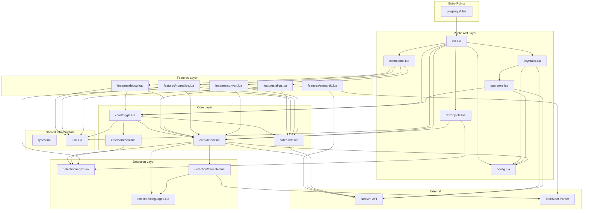
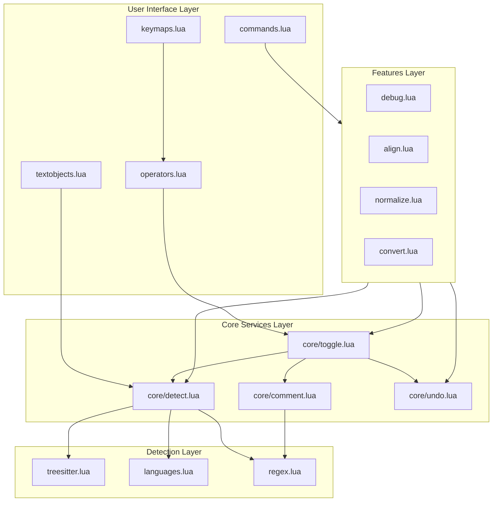
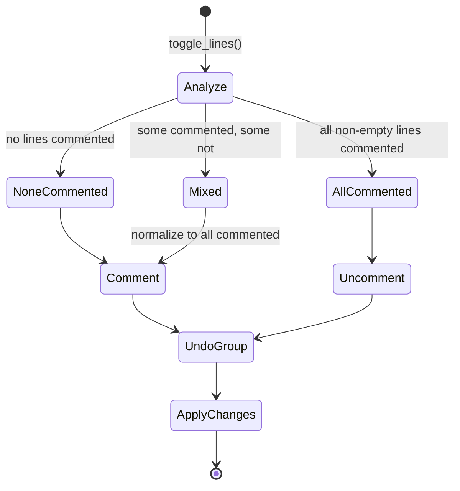
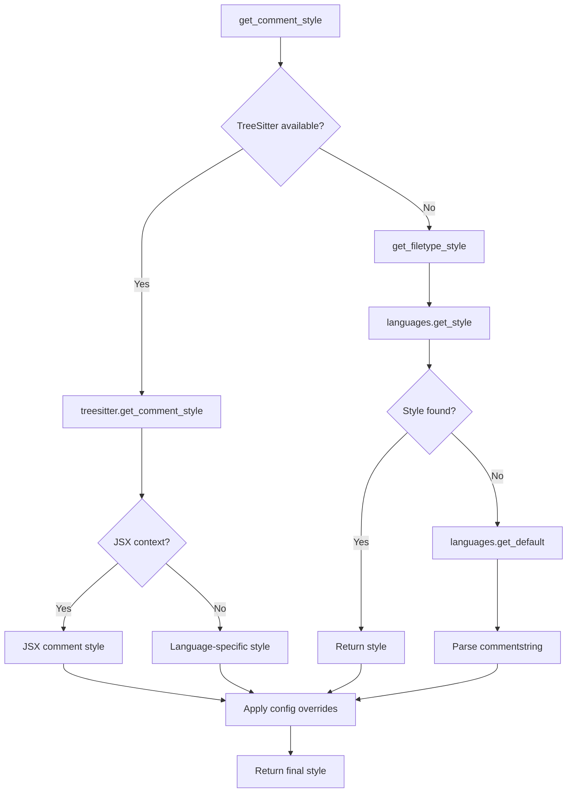
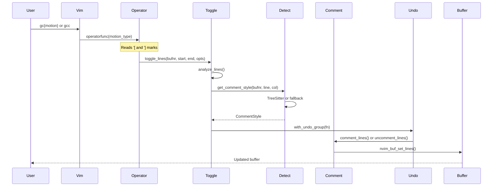

# Quill.nvim Architecture

## Overview

Quill.nvim is a Neovim plugin for intelligent comment toggling with TreeSitter-based context detection, support for 47 languages, and advanced features like debug region management and trailing comment alignment.

## Directory Structure

```
quill.nvim/
├── plugin/
│   └── quill.lua                  # Plugin entry point (VimEnter autocmd)
├── lua/quill/
│   ├── init.lua                   # Main module, public API
│   ├── config.lua                 # Configuration management with validation
│   ├── commands.lua               # :Quill user command dispatcher
│   ├── keymaps.lua                # Keymap registration with conflict detection
│   ├── operators.lua              # Vim operator implementation
│   ├── textobjects.lua            # Text object support (ic, ac, iC, aC)
│   ├── types.lua                  # Centralized LuaDoc type definitions
│   ├── utils.lua                  # Shared utility functions (pattern escaping, buffer context, validation)
│   ├── core/
│   │   ├── toggle.lua             # Toggle logic orchestration
│   │   ├── detect.lua             # Detection orchestrator (TreeSitter + fallback)
│   │   ├── comment.lua            # Comment marker manipulation
│   │   └── undo.lua               # Undo group management
│   ├── detection/
│   │   ├── languages.lua          # Language definitions (47 languages)
│   │   ├── regex.lua              # Regex-based comment detection
│   │   └── treesitter.lua         # TreeSitter-based detection
│   └── features/
│       ├── align.lua              # Trailing comment alignment
│       ├── debug.lua              # Debug region toggling
│       ├── normalize.lua          # Comment spacing normalization
│       ├── convert.lua            # Style conversion (line ↔ block)
│       └── semantic.lua           # Semantic selection (decorators, docstrings)
├── tests/
│   ├── minimal_init.lua           # Test initialization
│   ├── unit/                      # Unit tests for each module
│   ├── integration/               # Integration tests
│   └── languages/                 # Language-specific tests
└── scripts/                       # Build/test scripts
```

## Module Dependency Graph



## Component Interaction Diagram



## Core Components

### Entry Point (`plugin/quill.lua`)

- Guards against double-loading with `vim.g.loaded_quill`
- Uses `VimEnter` autocmd for lazy initialization
- Delegates to `init.lua` setup

### Public API (`init.lua`)

The main module exposes the public API:

| Function | Purpose |
|----------|---------|
| `setup(opts)` | Initialize plugin with configuration |
| `toggle_line()` | Toggle current line |
| `toggle_range(start, end)` | Toggle line range |
| `comment(start, end, style)` | Force comment lines |
| `uncomment(start, end)` | Force uncomment lines |
| `get_style(bufnr, line, col)` | Get comment style at position |
| `is_commented(bufnr, line)` | Check if line is commented |
| `normalize(bufnr)` | Normalize comment spacing |
| `align(start, end, opts)` | Align trailing comments |
| `toggle_debug(scope)` | Toggle debug regions |

### Configuration (`config.lua`)

**Pattern:** Singleton Configuration with Schema Validation

- Stores merged configuration (defaults + user options)
- Validates configuration against `VALIDATION_SCHEMA` using recursive `validate_rule()`
- Schema defines expected types for every config field (nested tables supported)
- Invalid configuration emits `vim.notify` error and prevents initialization
- Provides `get()` accessor for other modules

### Shared Types (`types.lua`)

**Pattern:** Centralized Type Definitions

All LuaDoc type annotations shared across the codebase are defined in a single module:

| Type | Purpose |
|------|---------|
| `CommentStyle` | Line/block markers, nesting support, JSX flag |
| `CommentMarkers` | Parsed marker positions and type |
| `DebugRegion` | Debug region start/end lines and comment state |
| `FeatureResult` | Standardized operation result (success, count, error) |
| `BufferContext` | Validated buffer metadata (bufnr, filetype, line count) |

### Shared Utilities (`utils.lua`)

**Pattern:** Shared Utility Module

Eliminates duplication of common operations across modules:

| Function | Purpose |
|----------|---------|
| `escape_pattern(str)` | Escape Lua pattern characters for literal matching |
| `is_blank_line(line)` | Check if line is empty or whitespace |
| `is_inside_string(line, pos)` | Quote-aware position check |
| `get_buffer_context(bufnr)` | Validate buffer and return `BufferContext` |
| `validate_numbers(name, ...)` | Validate numeric parameters |
| `assert_numbers(name, ...)` | Assert numeric parameters at API boundaries |

### Core Toggle (`core/toggle.lua`)

**Pattern:** Facade + State Machine

The toggle module orchestrates the commenting process:



### Core Detect (`core/detect.lua`)

**Pattern:** Strategy + Facade

The detection orchestrator provides unified comment style detection with a fallback chain:



### Core Comment (`core/comment.lua`)

**Pattern:** Builder

Handles the actual manipulation of comment markers with support for:
- Line comment addition/removal
- Block comment wrapping/unwrapping
- Nested block comment handling
- Automatic fallback to line style when nesting isn't supported

### Core Undo (`core/undo.lua`)

**Pattern:** Template Method

Provides undo grouping for multi-line operations:
- Callback-style: `with_undo_group(fn)`
- Manual style: `start_undo_group()` / `end_undo_group()`
- Supports nesting (tracks depth)
- Error-safe cleanup

### Operators (`operators.lua`)

**Pattern:** Vim Operator via `operatorfunc`

Uses Vim's `g@` mechanism to create a composable operator:

- `gc{motion}` sets `operatorfunc` and returns `g@`, letting Vim handle the motion
- `gcc` returns `count .. "g@_"` where `_` is the current-line motion
- Visual `gc` captures `vim.fn.mode()` into an `OperatorContext` before returning `g@`
- The `operatorfunc` callback reads `'[`/`']` marks and delegates to `toggle.toggle_lines()`
- Visual context determines block vs line comment style (block for V-line/block-visual multi-line)

### Keymaps (`keymaps.lua`)

**Pattern:** Unified Registration with Conflict Detection

All keymap registration flows through `M.register(modes, lhs, rhs, opts)`:

- Checks for existing mappings before overriding
- Emits warnings via `vim.notify` when `warn_on_override` is enabled
- Accepts single mode string or array of modes
- Setup delegates to `operators.setup_operators()`, `textobjects.setup()`, and inline leader registrations

## Detection Layer

### Languages Registry (`detection/languages.lua`)

**Pattern:** Registry

Contains 47 language definitions with:
- Line comment marker (e.g., `//`, `#`, `--`)
- Block comment pair (e.g., `{ "/*", "*/" }`)
- Nesting support flag
- JSX context flag

### TreeSitter Detection (`detection/treesitter.lua`)

**Pattern:** Adapter

Wraps TreeSitter API for context-aware detection:
- Embedded language detection
- JSX context detection (using "nearest context wins" logic)
- Comment/string node detection

### Regex Detection (`detection/regex.lua`)

Provides regex-based fallback detection:
- String-aware pattern matching (avoids false positives)
- Comment marker extraction
- Line content manipulation

## Features Layer

### Align (`features/align.lua`)

Aligns trailing comments to a consistent column:

```lua
-- Before:
local x = 1  -- value
local foo = "bar"    -- string

-- After (aligned to column 80):
local x = 1              -- value
local foo = "bar"        -- string
```

### Debug (`features/debug.lua`)

Toggle `#region debug` blocks:

```lua
-- #region debug
print("debugging info")
-- #endregion
```

Features buffer-wide and project-wide toggling with quickfix integration.

### Normalize (`features/normalize.lua`)

Fixes comment spacing inconsistencies:

```lua
-- Before:    //foo     //  bar    /*baz*/
-- After:     // foo    // bar     /* baz */
```

### Convert (`features/convert.lua`)

Converts between comment styles:

```lua
-- Line to block:
// comment  →  /* comment */

-- Block to line:
/* comment */  →  // comment
```

### Semantic (`features/semantic.lua`)

Semantic-aware selection expansion:
- Function boundary detection
- Decorator inclusion
- Doc comment inclusion (JSDoc, docstrings)

## Data Flow

### Toggle Operation Flow



## Design Patterns Summary

| Pattern | Location | Purpose |
|---------|----------|---------|
| **Facade** | `init.lua`, `core/detect.lua` | Simplify complex subsystems |
| **Strategy** | `core/detect.lua` | Switch between TS and regex detection |
| **Registry** | `detection/languages.lua` | Store language definitions |
| **Builder** | `core/comment.lua` | Construct commented lines |
| **Template Method** | `core/undo.lua` | Undo group lifecycle |
| **Singleton** | `config.lua` | Global configuration |
| **Adapter** | `detection/treesitter.lua` | Wrap TreeSitter API |
| **Command** | `commands.lua` | Encapsulate subcommands |
| **Dispatcher** | `commands.lua` | Route to handlers |

## Key Abstractions

### CommentStyle

The central data structure for comment information:

```lua
---@class CommentStyle
---@field line string|nil           -- Line comment marker ("//", "#", "--")
---@field block [string, string]|nil -- Block comment pair ({"/*", "*/"})
---@field supports_nesting boolean   -- Can block comments nest?
---@field jsx boolean               -- Is this a JSX context?
```

### ToggleOpts

Options for toggle operations:

```lua
---@class ToggleOpts
---@field style_type "line"|"block"|nil  -- Force specific comment style
---@field force_comment boolean|nil      -- Force comment operation
---@field force_uncomment boolean|nil    -- Force uncomment operation
```

### DebugRegion

Debug region bounds:

```lua
---@class DebugRegion
---@field start_line number    -- Line of #region debug
---@field end_line number      -- Line of #endregion
---@field is_commented boolean -- Content currently commented?
```

### FeatureResult

Standardized result from feature operations:

```lua
---@class FeatureResult
---@field success boolean      -- Whether the operation succeeded
---@field count number         -- Number of items affected
---@field error_msg string|nil -- Error message if failed
```

### BufferContext

Validated buffer metadata:

```lua
---@class BufferContext
---@field bufnr number         -- Buffer number
---@field filetype string      -- Buffer filetype
---@field line_count number    -- Total lines in buffer
---@field is_valid boolean     -- Whether buffer is valid
```

## Architecture Strengths

1. **Clean Separation of Concerns**
   - Core logic isolated from UI/keymaps
   - Detection abstracted behind unified API
   - Features are independent modules

2. **Fallback Chain**
   - TreeSitter → filetype → commentstring
   - Graceful degradation when TS unavailable

3. **Extensibility**
   - Easy to add new languages
   - User config overrides supported
   - Modular feature system

4. **Robustness**
   - String-aware detection (avoids false positives)
   - Undo grouping for atomic operations
   - Type validation throughout
